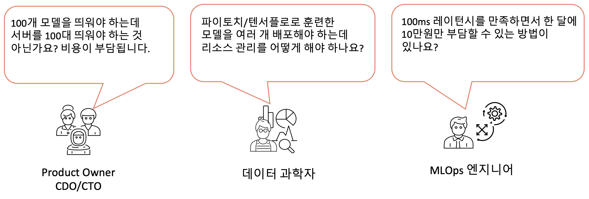
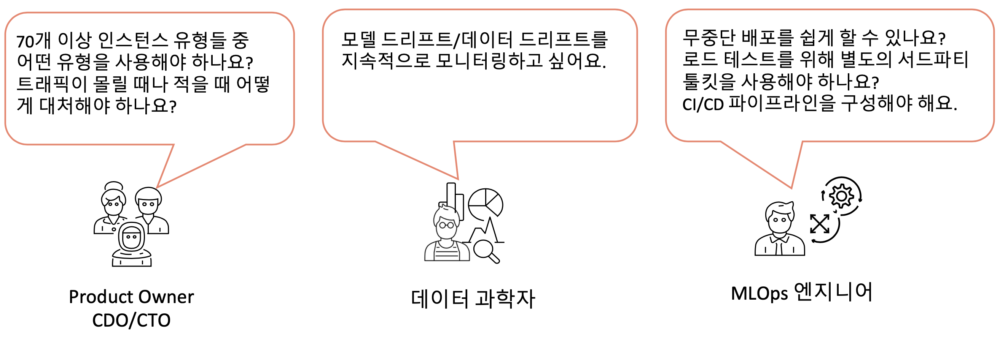

# SageMaker Model Serving Patterns - AWS 전문가와 함께 익히는 모델 서빙 패턴

---

## Overview
머신 러닝 알고리즘은 지난 10여년 간 급속도로 발전했으며, 수많은 사전 훈련된(pre-trained) 모델을 그대로 활용하거나 파인 튜닝으로 특정 유즈케이스에 적합한 모델로 개선함으로써 다양한 어플리케이션을 빠르게 개발할 수 있습니다. 모델 배포는 MLOps의 핵심 구성 요소이며 MLOps가 비즈니스와 함께 확장됨에 따라 인프라 구축의 중요성이 대두되고 있습니다. 하지만, 온프레미스에서 머신 러닝 모델을 프로덕션에 배포하고 관리하려면 인프라 구축 및 관리에 많은 노력과 비용이 들어가며 머신 러닝, 인프라 관리, 소프트웨어 엔지니어링에 모두 능숙한 실무자가 필요합니다. Amazon SageMaker는 대용량 모델 훈련과 모델 서빙에 필요한 인프라 관리에 대한 부담을 덜고 핵심 로직에 집중할 수 있게 도와 주는 AWS의 핵심 서비스입니다. 컴퓨팅 인프라의 비용을 최적화하고 서비스 인프라를 탄력적으로 확장할 수 있으며, 마이크로서비스 배포에 특화되어 있기에 빠른 실험 및 배포에 적합합니다.

본 워크샵은 Amazon SageMaker의 대표적인 모델 서빙 패턴들을 익힐 수 있게 구성되어 있으며, 각 모듈은 독립적으로 수행할 수 있습니다. 학습이 목적인 분들은 스텝 바이 스텝으로 모든 모듈을 실행하셔도 되지만, 특정 모델 서빙 패턴에 대한 예시만 필요한 분들은 해당 모듈만 실행하시면 됩니다.

## SageMaker For Beginners
본 워크샵은 SageMaker에 대한 기초 개념을 이해했다고 가정합니다. 만약 SageMaker를 처음 접해 보시거나 핵심 개념을 파악하지 못하셨다면, 아래 링크 자료들을 숙지해 주세요.
- [SageMaker Overview - 50 mins](https://www.youtube.com/watch?v=jF2BN98KBlg)
- [SageMaker Demo - 60 mins](https://www.youtube.com/watch?v=miIVGlq6OUk)
- [Containers for Amazon SageMaker Hosting](CONTAINER_FOR_SM.md)
- [Self Study on SageMaker](https://github.com/gonsoomoon-ml/Self-Study-On-SageMaker)
  
## Key Features

### [PTN1. Real-time Inference](key_features/ptn_1_realtime-inference)

SageMaker Endpoint는 REST API를 통해 실시간 추론을 수행할 수 있는 완전 관리형 서비스입니다. 기본적으로 분산 컨테이너로 고가용성, 다중 모델 로딩, A/B 테스트를 위한 인프라 환경(EC2, 로드밸런서, 오토스케일링, 모델 아티팩트 로딩 등)이 사전 구축되어 있기에 몇 줄의 코드만으로 Endpoint가 자동으로 생성되기에, 모델을 프로덕션에 빠르게 배포할 수 있습니다.

### [PTN2. Batch Inference](key_features/ptn_2_batch-transform)

Latency에 덜 민감한 애플리케이션이나 일정 주기(일단위, 주단위, 월단위 등)로 수행되는 일괄 추론 작업은 SageMaker Batch Transform을 사용하여 비용을 절감하는 것을 권장합니다. 상시 띄워져 있는 엔드포인트와 달리, Batch Transform은 배치 데이터에 대한 추론이 수행되는 순간에만 인스턴스를 사용하기 때문입니다. 이 때, Amazon S3에 저장되는 Batch Transform 출력값들을 Amazon DynamoDB 또는 RDS와 같은 데이터베이스와 연동하여 저장함으로써 대용량의 배치 job을 편리하게 수행할 수 있습니다.

### [PTN3. Asynchronous Inference](key_features/ptn_3_async-inference)

SageMaker 비동기(asynchronous) 추론 엔드포인트는 처리 시간이 수 분 이상 걸릴 수 있는 대규모 입력 페이로드를 사용하는 유즈케이스에 적합합니다.
AsyncInvokeEndpoint API를 호출하면 Amazon S3에 payload를 배치하고 별도의 관리형 queue에 입력 데이터에 대한 요청을 포인터로 전송합니다. 호스팅 인스턴스는 포인터를 사용하여 payload 데이터를 다운로드하고 추론 컨테이너를 통해 모델 추론 결괏값을 계산하여 S3에 저장합니다. 이 때, 선택적으로 SNS를 통해 추론이 완료되었다는 알림을 받을 수 있습니다. 

### [PTN4-1. Lambda Serverless Inference](key_features/ptn_4.1_lambda-serverless-inference)

re:Invent 2020에 소개된 Lambda 컨테이너 기능 지원으로 기존 Lambda에서 수행하기 어려웠던 대용량 머신 모델에 대한 추론을 보다 수월하게 실행할 수 있게 되었습니다. Lambda 컨테이너 이미지를 Amazon ECR(Amazon Elastic Container Registry)에 푸시하였다면 Lambda 함수를 생성하여 직접 컨테이너 이미지를 배포하거나 SageMaker의 API 호출로 Serverless endpoint를 쉽게 배포할 수 있습니다.
  
### [PTN4-2. SageMaker Serverless Inference](key_features/ptn_4.2_serverless-inference)

Amazon SageMaker Serverless Inference는 re:Invent 2021에 런칭된 신규 추론 옵션으로 호스팅 인프라 관리에 대한 부담 없이 머신 러닝을 모델을 쉽게 배포하고 확장할 수 있도록 제작된 신규 추론 옵션입니다. SageMaker Serverless Inference는 컴퓨팅 리소스를 자동으로 시작하고 트래픽에 따라 자동으로 스케일 인/아웃을 수행하므로 인스턴스 유형을 선택하거나 스케일링 정책을 관리할 필요가 없습니다. 따라서, 트래픽 급증 사이에 유휴 기간이 있고 콜드 스타트를 허용할 수 있는 워크로드에 이상적입니다.

### [PTN5. Multi-container Endpoint](key_features/ptn_5_multi-container-endpoint)

SageMaker 멀티 컨테이너 엔드포인트를 사용하면 서로 다른 serving 스택(예: 모델 서버, 머신 러닝 프레임워크, 프레임워크 버전, 알고리즘 등)에 구축된 여러 추론 컨테이너를 하나의 엔드포인트에서 실행하고 독립적으로 각 추론 컨테이너를 호출할 수 있습니다. 

- 인스턴스의 전체 수용량을 포화시킬 정도의 트래픽이 없는 경우에 여러 모델(예: Object Detection, Named Entity Recognition)을 서빙
- A/B 테스트와 같은 시나리오에서 서로 다른 프레임워크 버전(예: TensorFlow 1.x vs. TensorFlow 2.x)에서 실행되는 유사한 아키텍처의 비교

### [PTN6. Inference Pipeline](key_features/ptn_6_inference-pipeline)

추론 파이프라인은 단일 엔드포인트(single endpoint)에 2~5개 컨테이너(빌트인 컨테이너 or 사용자 정의 컨테이너)의 시퀀스를 단계(step)별로 연결합니다. 각 단계의 응답은 다음 단계의 추론 요청으로 사용되며, 이를 활용하여 PyTorch/TensorFlow/MXNet/scikit-learn/Spark ML 등의 다양한 프레임워크에 대한 모델 앙상블을 배포하거나 모델 전처리-추론-후처리 과정을 컨테이너로 분리하여 관리할 수 있습니다. 

## From PoC to Production

### [PTN1. A/B Testing](production/ptn_1_ab-test)

프로덕션 ML 워크플로에서 데이터 과학자와 머신 러닝 엔지니어는 데이터/모델/컨셉 드리프트에 따른 재훈련, 하이퍼파라메터 튜닝, 피쳐 선택 등과 같은 다양한 방법들을 통해 모델을 개선합니다. 이 때 이전 모델과 신규 모델 간의 A/B 테스트를 수행함으로써, 신규 모델에 대한 검증을 충분히 해야겠죠. 그렇다면 A/B 테스트를 위해 엔드포인트를 재배포하거나 2개의 엔드포인트를 배포해야 할까요? 그렇지 않습니다. 프로덕션 Variant 기능을 사용하면, 각 variant에 대해 동일한 엔드포인트 뒤에서 여러 모델 또는 모델 버전을 테스트할 수 있습니다.

### [PTN2. Blue/Green Deployment Guardrail](production/ptn_2_deployment-guardrail)

SageMaker 배포 가드레일(Deployment Guardrail)은 프로덕션 환경에서 현재 모델에서 새 모델로 안전하게 업데이트하기 위한 완전 관리형 블루/그린(Blue/Green) 배포 가드레일 서비스입니다. 카나리(Canary) 및 선형(Linear)과 같은 트래픽 전환 모드를 사용하여 업데이트 과정에서 현재 모델에서 새 모델로 트래픽 전환 프로세스를 세부적으로 제어할 수 있습니다. 또한 문제를 조기에 포착하고 프로덕션에 영향을 미치지 않게 자동 롤백과 같은 보호 기능을 제공합니다.

### [PTN3. End-to-end ML pipelines](production/ptn_3_ml-pipeline)

SageMaker Pipelines은 ML 파이프라인과 CI/CD 파이프라인을 쉽고 편리하게 수행할 수 있는 관리형 서비스입니다. re:Invent 2020 서비스 런칭 이후 신규 기능들이 지속적으로 업데이트되고 있으며, 특히 2021년 8월 업데이트된 주요 기능인 Lambda Step을 사용하면 호스팅 엔드포인트 모델 배포를 비롯한 서버리스 작업들을 쉽게 수행할 수 있습니다. 또한 캐싱(caching) 기능을 사용하면 모든 파이프라인을 처음부터 재시작할 필요 없이 변경된 파라메터에 대해서만 빠르게 실험해볼 수 있습니다.

## Cost Optimization

### [PTN1. Model Compilation using SageMaker Neo](cost_optimization/ptn_1_model-compile)

SageMaker Neo는 다양한 머신 러닝 프레임워크를 지원하며 정확도 손실을 최소화하면서 자동으로 모델을 최적화합니다. SageMaker Neo 컴파일러는 타겟 디바이스의 OS 및 하드웨어 플랫폼에 맞게 모델을 자동으로 최적화하고 딥러닝 런타임에서 모델을 실행 가능한 형태로 변환합니다. 딥러닝 런타임은 머신 러닝 프레임워크와 엣지 디바이스에 상관없이 단 두 줄의 코드로 추론을 수행할 수 있으며 런타임 버전은 지속적으로 업데이트됩니다. 

### [PTN2. Model Compilation for multiple on-devices](cost_optimization/ptn_2_model-compile-on-device)

단일 타겟 디바이스가 아니라 여러 종류의 타겟 디바이스에 모델을 배포하려면 어떤 방법이 좋을까요? 일일이 수동으로 컴파일해야 할까요?
그렇지 않습니다. SageMaker Neo로 과금 없이 여러 타겟 디바이스들에 적합하게 모델을 컴파일할 수 있습니다.
컴파일된 모델은 엣지 디바이스에서 곧바로 추론하거나, IoT Greengrass와 연동하여 IoT의 스트리밍 데이터를 받아서 추론을 수행할 수도 있습니다.

### [PTN3. Elastic Inference](cost_optimization/ptn_3_elastic-inference)

비싼 GPU 인스턴스를 배포 용도로 계속 띄워 놓게 되면 많은 비용이 발생할 수밖에 없고, 비용 절감을 위해 CPU 인스턴스를 쓰기에는 충분한 latency를 보장할 수 없습니다. 이럴 때 바로 Elastic Inference를 사용하시면 됩니다. Elastic Inference는 평소에는 CPU 인스턴스를 사용하다가 추론 시에 GPU 엑셀러레이터를 빌려오는 개념이며, 이를 통해 GPU의 컴퓨팅 파워를 사용하면서 GPU 인스턴스 대비 추론 비용을 최대 75%까지 절감할 수 있습니다. 호스트 인스턴스와 추론 가속 하드웨어를 분리할 수 있는 유연성이 있으므로 애플리케이션에 필요한 CPU, 메모리 및 기타 모든 리소스에 대해 하드웨어를 유연하게 최적화할 수 있습니다. 

## References

### Key Features
#### Real-time Inference
- [AWS Innovate 2021 - Amazon SageMaker 기반 사전 훈련된 딥러닝 모델 손쉽게 배포하기 (김대근 AIML SA)](https://www.youtube.com/watch?v=ZdOcrLKow3I)
- [Developer Guide](https://docs.aws.amazon.com/sagemaker/latest/dg/realtime-endpoints.html)

#### Batch Inference
- [AWS AI/ML Blog](https://aws.amazon.com/blogs/machine-learning/performing-batch-inference-with-tensorflow-serving-in-amazon-sagemaker/)
- [Developer Guide](https://docs.aws.amazon.com/sagemaker/latest/dg/batch-transform.html)

#### Asynchronous Inference
- [AWS AI/ML Blog](https://aws.amazon.com/ko/blogs/machine-learning/run-computer-vision-inference-on-large-videos-with-amazon-sagemaker-asynchronous-endpoints/)
- [Developer Guide](https://docs.aws.amazon.com/sagemaker/latest/dg/async-inference.html)

#### Lambda Serverless Inference
- [AWS AI/ML Blog](https://aws.amazon.com/ko/blogs/korea/new-for-aws-lambda-container-image-support/)
- [SageMaker Python SDK](https://sagemaker.readthedocs.io/en/stable/overview.html?highlight=lambdamodel#serverless-inference)
- [AWS Builders Online - AWS Lambda 컨테이너 이미지 서비스 활용하기 (김태수 SA)](https://www.youtube.com/watch?v=tTg9Lp7Sqok)
  
#### SageMaker Serverless Inference
- [AWS AI/ML Blog](https://aws.amazon.com/ko/blogs/machine-learning/deploying-ml-models-using-sagemaker-serverless-inference-preview/)
- [Developer Guide](https://docs.aws.amazon.com/sagemaker/latest/dg/serverless-endpoints.html)

#### Multi-container Endpoint
- [AWS AI/ML Blog](https://aws.amazon.com/ko/blogs/machine-learning/deploy-multiple-serving-containers-on-a-single-instance-using-amazon-sagemaker-multi-container-endpoints/)
- [Developer Guide](https://docs.aws.amazon.com/sagemaker/latest/dg/multi-container-endpoints.html)

#### Inference Pipeline
- [AWS AI/ML Blog](https://aws.amazon.com/ko/blogs/machine-learning/preprocess-input-data-before-making-predictions-using-amazon-sagemaker-inference-pipelines-and-scikit-learn/)
- [Developer Guide](https://docs.aws.amazon.com/sagemaker/latest/dg/inference-pipelines.html)

### From PoC to Production
 
#### A/B Testing
- [AWS AI/ML Blog](https://aws.amazon.com/ko/blogs/machine-learning/a-b-testing-ml-models-in-production-using-amazon-sagemaker/)
- [AWS AI/ML Blog - Advanced](https://aws.amazon.com/ko/blogs/machine-learning/dynamic-a-b-testing-for-machine-learning-models-with-amazon-sagemaker-mlops-projects/)
- [Developer Guide](https://docs.aws.amazon.com/sagemaker/latest/dg/model-ab-testing.html)

#### Blue/Green Deployment Guardrail
- [AWS AI/ML Blog](https://aws.amazon.com/ko/blogs/machine-learning/take-advantage-of-advanced-deployment-strategies-using-amazon-sagemaker-deployment-guardrails/)
- [Developer Guide](https://docs.aws.amazon.com/sagemaker/latest/dg/deployment-guardrails.html)

#### End-to-end ML pipelines 
- [AWS AI/ML Blog](https://aws.amazon.com/ko/blogs/machine-learning/building-automating-managing-and-scaling-ml-workflows-using-amazon-sagemaker-pipelines/)
- [AWS AI/ML Blog - Advanced](https://aws.amazon.com/ko/blogs/machine-learning/building-a-scalable-machine-learning-pipeline-for-ultra-high-resolution-medical-images-using-amazon-sagemaker/)
- [Developer Guide](https://docs.aws.amazon.com/sagemaker/latest/dg/pipelines.html)

### Korean NLP and Hugging Face
- [KoELECTRA](https://github.com/monologg/KoELECTRA)
- [Naver Sentiment Movie Corpus v1.0](https://github.com/e9t/nsmc)
- [Hugging Face on Amazon SageMaker](https://huggingface.co/docs/sagemaker/main)
- [Hugging Face examples](https://github.com/huggingface/notebooks/tree/master/sagemaker)

## License Summary

이 샘플 코드는 MIT-0 라이센스에 따라 제공됩니다. LICENSE 파일을 참조하십시오.